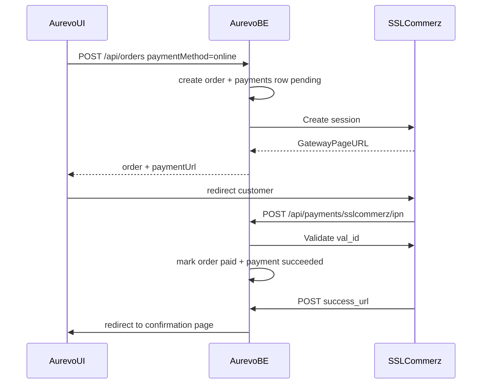

# SSLCommerz Payment Integration (Parked Plan)

**Status:** Planned, **not started**. Waiting on SSLCommerz sandbox merchant credentials.
When sandbox access is available, implement this doc as written — do not re-scope unless product requirements change.

**Related backlog:** [`01-requirements.md`](01-requirements.md) → Payment gateway integration; also listed in [`backlog.md`](backlog.md).

---

## Reality check

- Sandbox development is free once registered at [developer.sslcommerz.com/registration](https://developer.sslcommerz.com/registration/).
- Live is **not** free: SSLCommerz Basic is currently **৳25,500** setup + **2.5%** per successful transaction (3.5% AMEX). See [sslcommerz.com/pricing](https://sslcommerz.com/pricing/).
- This plan ships **sandbox-ready production code** gated by env. Going live is mostly credentials + panel settings, not a rewrite.

## Current hooks we will reuse

- Schema already has `payment_method` `cash|online`, `payment_status`, and [`payments`](../src/db/schema.ts) (`payment_intent_id`, `gateway_response`).
- [`createOrder`](../src/app/modules/orders/orders.service.ts) already accepts `paymentMethod` and decrements stock on create.
- Courier already treats unpaid cash as COD and prepaid online as `cod_amount: 0` ([`courier.service.ts`](../src/app/modules/courier/courier.service.ts)).
- Follow the Steadfast pattern: thin `fetch` client in `src/lib/`, optional env, business error when used while unset ([`steadfast.ts`](../src/lib/steadfast.ts)).

## Locked design choices

1. **Hosted redirect** (not Easy Checkout JS) — BE creates a session, FE redirects to `GatewayPageURL`.
2. **No third-party SSLCommerz npm SDK** — custom typed client (same style as Steadfast/Voyage).
3. **Sandbox default**: `SSLCOMMERZ_IS_LIVE=false` → `https://sandbox.sslcommerz.com`; live → `https://securepay.sslcommerz.com`.
4. **Optional credentials** (like courier): app boots without them; choosing `online` without keys returns a clear business error.
5. **IPN is source of truth** for marking paid; success callback also validates idempotently (covers lost IPN).
6. **Stock stays as today** — decrement on order create. Unpaid abandoned online orders are cancelled via existing cancel/stock-restore paths (admin or future cleanup).
7. **`tran_id` = `orderNumber`** (unique, short enough for SSLCommerz’s 30-char limit).
8. **Currency always `BDT`** when writing `payments` rows (column default is still `USD` historically — set BDT on insert; add a small Drizzle migration to flip the default to `BDT`).

## Payment flow

## Backend work

### Config / env ([`src/app/config/index.ts`](../src/app/config/index.ts), [`.env.example`](../.env.example))

Optional:

- `SSLCOMMERZ_STORE_ID`
- `SSLCOMMERZ_STORE_PASSWD`
- `SSLCOMMERZ_IS_LIVE` (`"true"|"false"`, default `false`)

Derived base URL from `IS_LIVE`. No CI required-env change (optional like courier).

### Client — `src/lib/sslcommerz.ts`

- `sslcommerzEnabled()`
- `initPaymentSession(params)` → session + `GatewayPageURL`
- `validatePayment(val_id)` → amount/status/tran_id
- Map failures to `UpstreamServiceError` / `BusinessRuleError` as appropriate
- Never log store password; rely on existing logger redaction

### Module — `src/app/modules/payments/`

Pattern: `payments.schema.ts` → `payments.service.ts` → `payments.controller.ts` → `payments.routes.ts` → `payments.test.ts`

Routes (mount under `/api/payments`):

- `POST /sslcommerz/session` — auth optional (owner or guest token); starts/restarts session for an unpaid `online` order; returns `{ paymentUrl, orderNumber }`
- `POST /sslcommerz/ipn` — public; validate with SSLCommerz; idempotent paid update
- `POST /sslcommerz/success|fail|cancel` — public browser callbacks; validate on success; **always `res.redirect` to FE** (same rule as OAuth callbacks — never JSON to the browser)

Order create integration ([`orders.controller.ts`](../src/app/modules/orders/orders.controller.ts) / service):

- When `paymentMethod === "online"`:
  - Insert `payments` row (`pending`, amount = order total, currency `BDT`, method `online`)
  - If SSL enabled: init session and include `paymentUrl` in the 201 response
  - If SSL disabled: fail with clear `BusinessRuleError` (“Online payment is not configured”)
- When `cash`: unchanged; no SSL call; confirmation email still fires
- When `online`: **defer confirmation email until paid** (IPN/success path), so customers don’t get “confirmed” before payment

Paid update (shared helper):

- Validate `status` is `VALID`/`VALIDATED`, amount matches order total, `tran_id` matches `orderNumber`
- If `risk_level === 1`: leave pending / log warn (do not auto-fulfill)
- Set `orders.paymentStatus = paid`, `payments.status = succeeded`, store `gateway_response`, set `payment_intent_id` / processedAt
- Idempotent on replay
- Then fire confirmation email once

### Docs / policy touch-ups during implementation

- Sandbox signup notes + test cards (VISA `4111111111111111`, Exp `12/26`, CVV `111`; OTP `111111` or `123456`)
- Local IPN via tunnel (`BACKEND_URL` must be public for IPN)
- Update [`content/policies/payment.md`](../content/policies/payment.md) once online actually works, then re-run `pnpm ingest:knowledge` if the chatbot should reflect it

### Tests

Vitest + Supertest with mocked SSL HTTP (same style as courier mocks):

- Online create returns `paymentUrl` when enabled
- Online create errors when unset
- IPN validates and marks paid once; replay is no-op
- Amount / `tran_id` mismatch rejects
- Cash path unchanged
- Success callback redirects to FE

## Frontend contract (Aurevo.UI — separate pass)

- Checkout: allow selecting Online when BE reports payment available (or always show; BE errors if unset).
- After `POST /orders` with `online`, redirect to `data.paymentUrl`.
- Handle return URLs, e.g. `{FRONTEND_URL}/order-confirmation?orderNumber=…&payment=success|failed|cancelled`.
- Keep COD path identical.

## Implementation checklist (when sandbox is ready)

- [ ] Create SSLCommerz sandbox account and obtain Store ID + Store Password
- [ ] Add optional env + `src/lib/sslcommerz.ts`
- [ ] Add `src/app/modules/payments/` (session, IPN, success/fail/cancel)
- [ ] Wire online `createOrder` → payments row + `paymentUrl`; defer confirmation email until paid
- [ ] Drizzle migration: `payments.currency` default → `BDT`
- [ ] Tests green + `pnpm build`
- [ ] Aurevo.UI checkout online option + return URLs
- [ ] Point sandbox panel IPN at a tunnel / Railway URL ending in `/api/payments/sslcommerz/ipn`

## Go-live checklist (sandbox → purchased live)

When purchasing / activating SSLCommerz live, change **only**:

1. Register live merchant at [signup.sslcommerz.com](https://signup.sslcommerz.com/register) (trade license / TIN / bank docs as required).
2. Pay setup fee and receive **live** Store ID + Store Password (different from sandbox).
3. Railway (prod) env:
   - `SSLCOMMERZ_STORE_ID=<live id>`
   - `SSLCOMMERZ_STORE_PASSWD=<live password>`
   - `SSLCOMMERZ_IS_LIVE=true`
4. SSLCommerz merchant panel → IPN Settings →
   `https://api-aurevofashion.up.railway.app/api/payments/sslcommerz/ipn`
   (or current production `BACKEND_URL`).
5. Confirm prod `BACKEND_URL` and `FRONTEND_URL` are production origins (success/fail/cancel are built from these).
6. Run one small live smoke payment, then refund/cancel in panel if needed.
7. No code deploy required for the sandbox→live flip **if** the above env/panel steps are done on an already-deployed build that includes this feature.

## Out of scope for the first pass

- Stripe / PayPal / bKash-direct
- Changing stock accounting model
- Admin refund UI
- Auto-cancel unpaid online orders after N hours
- Easy Checkout embed
- Refunds API

## Official references

- [SSLCommerz developer docs (v4)](https://developer.sslcommerz.com/doc/v4/)
- [Sandbox registration](https://developer.sslcommerz.com/registration/)
- [Live signup](https://signup.sslcommerz.com/register)
- [Pricing](https://sslcommerz.com/pricing/)
